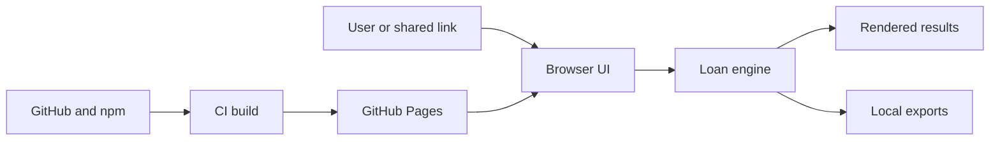

# Loan EMI Calculator Threat Model

## Executive summary

Loan Ledger is a low-complexity static calculator with no backend, authentication, storage, or runtime third-party network calls. Its main risks are disclosure when users deliberately copy financial inputs into URLs and build-chain compromise through npm or GitHub Actions. Strict fragment parsing, list caps, constant-time recurrence checks, provenance messaging, and CI privilege separation resolved TM-001 through TM-005. TM-006 remains an accepted low residual risk because the browser runtime has no privileged action. No critical or high runtime vulnerability was found.

## Scope and assumptions

- In scope: `src/`, `index.html`, `package.json`, `package-lock.json`, `vite.config.ts`, and `.github/workflows/deploy.yml`.
- Tests and documentation are reviewed as supporting controls, not production entry points.
- Assumed deployment: public GitHub Pages over HTTPS, public internet exposure, individual users, no backend/auth/database/analytics, and only npm/GitHub Actions as privileged external systems.
- Financial inputs are moderately sensitive. They stay local unless a user explicitly generates and shares a fragment URL (`src/lib/share.ts:encodeScenario`, `scenarioUrl`).
- These assumptions were presented for validation but were not confirmed. Adding telemetry, remote scripts, authentication, a backend, or multi-tenancy would materially increase risk and require a new model.

Open questions that would change ranking:

- Will any analytics, advertising, tag manager, or remote script be added?
- Will the repository accept untrusted pull requests that execute CI?
- Will the calculator be promoted for regulated or lender-approved decisions rather than educational estimates?

## System model

### Primary components

- React browser UI accepts financial inputs and renders results (`src/App.tsx:App`).
- The pure TypeScript engine validates and calculates standard and OD schedules (`src/domain/loan/index.ts:calculateLoan`).
- Share parsing serializes scenarios into URL fragments (`src/lib/share.ts`).
- Export code creates local CSV/XLSX downloads; ExcelJS is lazy-loaded (`src/lib/exports.ts`).
- GitHub Actions installs dependencies, tests, builds, and deploys static `dist` files (`.github/workflows/deploy.yml`).

### Data flows and trust boundaries

- User → browser UI: financial numbers and dates cross through native form controls; domain validation applies ranges and date rules, with no authentication or rate limiting.
- Shared URL → fragment decoder → calculation engine: base64url JSON crosses an untrusted-input boundary; version, length, declared-field types, nested members, IDs, and 100-entry list caps are checked before calculation.
- Calculation engine → DOM: React text rendering escapes values; the repository contains no `innerHTML`, `dangerouslySetInnerHTML`, `eval`, or remote runtime fetch.
- Calculation result → local download/clipboard: CSV/XLSX/blob and fragment URLs leave the page only after an explicit user action.
- GitHub/npm → CI runner → Pages: third-party packages execute in a read-only build job; a separate Pages/OIDC-enabled deploy job consumes the verified artifact. The lockfile pins npm artifacts and workflow actions use immutable commit references.

#### Diagram

## Assets and security objectives

| Asset | Why it matters | Security objective (C/I/A) |
|---|---|---|
| Financial scenario inputs | May reveal property value, loan size, rates, and available liquidity | C, I |
| Calculation formulas and schedules | Incorrect results may cause poor financial decisions | I, A |
| Share fragments | Carry complete user-controlled scenarios and may disclose inputs | C, I |
| Exported CSV/XLSX files | Users may rely on them as an audit record | I |
| CI credentials and Pages artifact | Compromise could publish malicious calculator code | C, I, A |
| Public site availability | Users expect the calculator to load and respond | A |

## Attacker model

### Capabilities

- A remote attacker can craft and send a calculator URL with an arbitrary fragment up to 8,000 characters.
- A dependency or GitHub Action maintainer compromise could affect a future build.
- A malicious site can link to or frame the public calculator.
- A recipient of a shared URL can read and modify all encoded financial inputs.

### Non-capabilities

- There is no server, database, account, session, authorization boundary, upload parser, or application secret to attack.
- URL fragments are not sent in HTTP requests to GitHub Pages.
- The app performs no runtime fetch, SSRF-capable request, dynamic code execution, or raw HTML insertion.
- An attacker cannot persist changes for other users without compromising the deployed artifact or convincing them to open a link.

## Entry points and attack surfaces

| Surface | How reached | Trust boundary | Notes | Evidence (repo path / symbol) |
|---|---|---|---|---|
| Form inputs | Direct browser interaction | User → UI/engine | Numeric/date ranges and 100-entry caps apply before schedule generation | `src/App.tsx:NumberField`; `src/domain/loan/index.ts:validateScenario` |
| URL fragment | Opening a shared link | Internet/link → decoder | Strict all-or-nothing parsing of supplied declared fields; unknown fields are discarded | `src/lib/share.ts:decodeScenario`; `src/lib/share.test.ts` |
| Clipboard share | Explicit button | App → OS clipboard/history | Complete scenario is intentionally disclosed | `src/lib/share.ts:copyScenarioUrl` |
| CSV/XLSX exports | Explicit buttons | App → local filesystem | Values originate in the validated result model | `src/lib/exports.ts` |
| GitHub Actions | Push or manual dispatch | Source/dependencies → CI/Pages | Read-only build and privileged deploy are separate; actions use immutable commits | `.github/workflows/deploy.yml`; `.github/dependabot.yml` |
| npm dependency graph | `npm ci --ignore-scripts`, lazy XLSX import | Registry → build/runtime bundle | Exact versions, lockfile, ignored install scripts, lazy loading, and update automation reduce but do not eliminate risk | `package-lock.json`; `package.json`; `.github/dependabot.yml` |

## Reviewed abuse paths and disposition

1. A malformed valid-version fragment is rejected as a unit and defaults load with a warning. Deep decoder and browser recovery tests cover this path. **TM-001 Resolved.**
2. A received scenario displays a persistent provenance notice that tells the recipient to verify inputs. **TM-002 Resolved.**
3. Copying a share link still places the complete scenario in downstream clipboard/history/chat systems, but the action is explicit and warns about disclosure. **TM-003 Resolved with documented user-controlled disclosure.**
4. Large recurring-prepayment lists use direct cycle indexes and every optional list has a 100-entry cap. **TM-005 Resolved.**
5. npm code runs in the read-only build job; immutable actions and a separate privileged deploy job limit artifact-publishing exposure. **TM-004 Resolved with low supply-chain residual risk.**
6. A framing site can still present deceptive surrounding content. The calculator has no account, payment, data-write, or other privileged runtime action. **TM-006 Accepted, low residual risk.**

## Threat model table

| Threat ID | Threat action and impact | Status | Implementing evidence | Regression or operational evidence | Residual risk |
|---|---|---|---|---|---|
| TM-001 | Malformed nested fragment values crash a recipient's calculation. | **Resolved** | `e73b736`, `8eec604`: strict declared-field parsing, nested validation, list caps, and safe fallback in `src/lib/share.ts`. | Malformed, unknown-key, nested-field, ID, and length cases in `src/lib/share.test.ts`; browser recovery in `e2e/sharing-errors.spec.ts`. | Low: a recipient can still open arbitrary links, but invalid state does not enter the engine. |
| TM-002 | A recipient trusts attacker-modified but plausible financial inputs. | **Resolved** | `a9218f7`: persistent shared-link provenance and verification notice in `src/App.tsx`. | Provenance reset and new-context round-trip cases in `e2e/sharing-errors.spec.ts`. | Low: recipients must still review visible inputs; the app cannot authenticate a sender. |
| TM-003 | A copied URL exposes financial inputs through clipboard, history, chat, or screenshots. | **Resolved** | Existing fragment-only, explicit-copy architecture plus `a9218f7` trusted-state handling; no runtime network transmission. | Copy warning and cross-context share cases in `src/App.tsx` and `e2e/sharing-errors.spec.ts`. | Low: disclosure remains intentional and user-controlled once a link leaves the browser. |
| TM-004 | A compromised dependency or action publishes malicious Pages assets or accesses CI credentials. | **Resolved** | `a231459`: `npm ci --ignore-scripts`, immutable action commits, read-only build job, separate Pages/OIDC deploy job, exact toolchain, and Dependabot. | `.github/workflows/deploy.yml` verifies before artifact upload and grants write permissions only to `deploy`; Pages-subpath e2e runs in `build`. | Low: trusted build dependencies still execute during test/build and require updates and review. |
| TM-005 | Maximum optional lists and recurring prepayments freeze the main thread. | **Resolved** | `5257de2`, `938e53f`: direct cycle indexes, integer recurrence, and 100-entry caps for rate changes, prepayments, and OD transactions. | Supported-maximum timing plus frequency/index/list-limit cases in `src/domain/loan/loan.test.ts`. | Low: the bounded daily OD ledger still runs on the main thread but remains within the supported horizon. |
| TM-006 | A framing site overlays deceptive instructions and induces sharing. | **Accepted** | The runtime has no account, payment, server-side data write, or other privileged action. | Reassess after hosting changes or any privileged runtime feature. | **Low residual risk.** A custom header-capable host becomes appropriate if privileged actions are added. |

## Criticality calibration

- Critical: remote code execution in all visitors’ browsers, CI credential theft enabling organization-wide compromise, or silent cross-user data exfiltration. No current example was found.
- High: malicious artifact publication, systematic silent calculation tampering, or automatic transmission of all financial scenarios. TM-004 has high potential impact but low likelihood and existing controls, so it is medium overall.
- Medium: crafted-link crashes, plausible scenario tampering, share-link disclosure, or reliable browser freezes affecting one recipient. The hardening controls resolved these identified paths; their remaining risks are low under the current static architecture.
- Low: visual deception without a privileged action, verbose errors without sensitive data, or a recoverable local export failure. TM-006 is low.

## Focus paths for security review

| Path | Why it matters | Related Threat IDs |
|---|---|---|
| `src/lib/share.ts` | Parses the only remote attacker-controlled runtime input | TM-001, TM-002, TM-003 |
| `src/domain/loan/index.ts` | Integrity-critical calculations, validation, direct recurrence indexing, and bounded daily ledger | TM-001, TM-002, TM-005 |
| `src/App.tsx` | Controls provenance messages, share/export actions, and error behavior | TM-002, TM-003 |
| `src/lib/exports.ts` | Moves calculated data into local files and loads the largest dependency | TM-003, TM-004 |
| `.github/workflows/deploy.yml` | Holds deployment permissions and executes third-party code | TM-004 |
| `package.json` | Defines runtime/build dependencies and scripts | TM-004 |
| `package-lock.json` | Pins the transitive dependency graph | TM-004 |

## Quality check

- [x] Covered form, fragment, clipboard, export, dependency, CI, and hosting entry points.
- [x] Covered user/browser, shared-link/browser, registry/CI, and CI/Pages boundaries.
- [x] Separated production runtime from CI/build and tests.
- [x] Recorded that deployment assumptions were requested but not confirmed.
- [x] Listed assumptions and context changes that require a new threat model.
