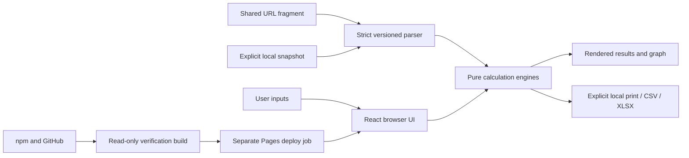

# Loan EMI Calculator Threat Model

**Reviewed:** 2026-07-12
**Scope:** Browser application, build dependencies, and GitHub Pages workflow

## Executive summary

The calculator suite is a static, client-only application. It has no backend, account, authentication, database, analytics, cookie, runtime API request, or remote script. Each tab calculates independently in memory. The only persistence is a single versioned `localStorage` snapshot created by an explicit **Remember** action and loaded only by an explicit **Restore saved** action.

The main risks are deliberate disclosure through copied share URLs or downloaded files, malicious/malformed external state, misleading financial results, local-device access to a remembered snapshot, and npm/GitHub Actions supply-chain compromise. Strict parsing, bounded inputs, React escaping, explicit user actions, calculation invariants, lazy exports, immutable workflow actions, and CI privilege separation reduce these risks. No critical or high runtime vulnerability was found.

## Architecture and trust boundaries

- **User → UI/engine:** numbers, dates, selections, and bounded lists cross into field and domain validation.
- **URL/storage → parser:** attacker-controlled or stale JSON crosses an untrusted boundary. The V2 suite codec declares fields, types, shapes, versions, and list limits; invalid state is rejected atomically. V1 compatibility accepts only the legacy Home schema.
- **Engine → DOM:** React renders text and attributes. Production source has no raw HTML insertion, `eval`, dynamic code execution, runtime fetch/WebSocket, or remote resources.
- **Engine → clipboard/files:** financial data leaves the page only after an explicit Share, Print, CSV, or XLSX action.
- **Local snapshot:** the current origin can read the snapshot; other tabs do not automatically import it and no `storage` event synchronizes state.
- **Dependencies → CI → Pages:** lockfile-pinned packages run in a read-only build job. Only the downstream deploy job has `pages: write` and `id-token: write`.

## Assets and security objectives

| Asset | Objective |
|---|---|
| Loan values, income assumptions, fees, and liquidity | Confidentiality and integrity |
| Calculation formulas, schedules, and solver outputs | Integrity and availability |
| Shared fragments and remembered snapshot | Confidentiality, integrity, explicit user control |
| CSV/XLSX/print records | Integrity |
| Pages artifact and deployment credentials | Integrity, confidentiality, availability |

## Threats and controls

| ID | Threat | Controls | Residual risk |
|---|---|---|---|
| TM-001 | Crafted URL or stored JSON crashes the app or injects invalid state. | 8,000-character share cap; strict declared-field parsing; version checks; atomic rejection; 100-entry list caps; safe defaults and browser recovery tests. | Low: plausible valid values can still be altered by a link sender. Recipients must verify visible inputs. |
| TM-002 | Financial data is transmitted without consent. | No runtime network APIs, backend, telemetry, cookies, remote assets, or service worker; fragment data is not part of the HTTP request; exports and sharing require explicit actions. | Low: copied links, clipboard managers, browser history, messages, screenshots, and exported files can disclose data after the user chooses to share them. |
| TM-003 | Remembered state leaks across tabs or devices. | Only one explicit local snapshot; no automatic restore or storage-event listener; each tab keeps independent active state; browser-origin storage never synchronizes to another machine through the app. | Low: anyone with access to the same browser profile/origin may read or restore the snapshot. Private browsing and browser sync policies are outside the app. |
| TM-004 | Formula, rounding, event order, or stale-result behavior misleads users. | Pure typed engines; unit/golden/invariant tests; field-keyed validation; last-valid result is labelled; share/print/export disabled while current inputs are invalid; educational disclaimer. | Medium: lender-specific rules and future rate behavior can differ from estimates. |
| TM-005 | Maximum schedules or lists freeze the main thread. | Bounded dates, tenures, principal/rate ranges, and 100-entry lists; direct cycle indexes; deterministic performance tests; graph/schedule deferred below the fold. | Low under supported limits. |
| TM-006 | Spreadsheet content becomes an injection vector. | Exported cells are generated from validated typed values and fixed labels; CSV remains machine-readable; XLSX dates/numbers/percentages/integers/Booleans are native cells. | Low. Reassess if free-form user text is exported. |
| TM-007 | Dependency or workflow compromise publishes malicious assets. | Exact dependency lockfile, `npm ci --ignore-scripts`, production audit, Dependabot, immutable action SHAs, read-only build job, separate privileged deploy job, verified artifact. | Low but ongoing; trusted build dependencies still execute during build/test. |
| TM-008 | A framing site presents deceptive instructions around the calculator. | No account, payment, server write, or privileged runtime action. | Accepted low risk on GitHub Pages, which cannot set a repository-controlled `frame-ancestors` response header. |

## Security-sensitive files

- `src/lib/suite-codec.ts`, `src/lib/share.ts`: external-state boundary.
- `src/lib/remembered-scenario.ts`: explicit local persistence boundary.
- `src/domain/amortization/`, `src/domain/calculators/`, `src/domain/loan/`: calculation integrity.
- `src/lib/exports.ts`: file-generation boundary and lazy ExcelJS import.
- `src/App.tsx`: provenance, reset, restore, sharing, export, and lazy-loading orchestration.
- `.github/workflows/deploy.yml`, `package.json`, `package-lock.json`: supply chain and release permissions.

## Reassessment triggers

Perform a new threat model before adding a backend, authentication, accounts, cloud sync, telemetry, advertisements, tag managers, remote fonts/scripts, payment flows, free-form exported text, lender integrations, or claims of regulated/lender-approved advice. Re-run dependency and workflow review on toolchain upgrades.

## Verification checklist

- [x] Malformed shared and remembered state is rejected.
- [x] Independent tabs do not synchronize active calculations.
- [x] No runtime network, cookie, service-worker, or storage-listener path exists.
- [x] Share/export/print/persistence require explicit actions.
- [x] Calculation reconciliation and supported-maximum performance are tested.
- [x] Production dependencies report no known vulnerability.
- [x] GitHub Actions separate verification and deployment privileges.
