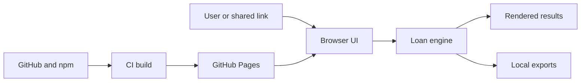

# Loan EMI Calculator Threat Model

## Executive summary

Loan Ledger is a low-complexity static calculator with no backend, authentication, storage, or runtime third-party network calls. Its main risks are calculation integrity and availability when opening attacker-controlled share fragments, disclosure when users deliberately copy financial inputs into URLs, and build-chain compromise through npm or GitHub Actions. No critical or high runtime vulnerability was found; the highest priorities are medium-risk input hardening and CI privilege separation.

## Scope and assumptions

- In scope: `src/`, `index.html`, `package.json`, `package-lock.json`, `vite.config.ts`, and `.github/workflows/deploy.yml`.
- Tests and documentation are reviewed as supporting controls, not production entry points.
- Assumed deployment: public GitHub Pages over HTTPS, public internet exposure, individual users, no backend/auth/database/analytics, and only npm/GitHub Actions as privileged external systems.
- Financial inputs are moderately sensitive. They stay local unless a user explicitly generates and shares a fragment URL (`src/lib/share.ts:encodeScenario`, `scenarioUrl`).
- These assumptions were presented for validation but were not confirmed. Adding telemetry, remote scripts, authentication, a backend, or multi-tenancy would materially increase risk and require a new model.

Open questions that would change ranking:

- Will any analytics, advertising, tag manager, or remote script be added?
- Will the repository accept untrusted pull requests that execute CI?
- Will the calculator be promoted for regulated or lender-approved decisions rather than educational estimates?

## System model

### Primary components

- React browser UI accepts financial inputs and renders results (`src/App.tsx:App`).
- The pure TypeScript engine validates and calculates standard and OD schedules (`src/domain/loan/index.ts:calculateLoan`).
- Share parsing serializes scenarios into URL fragments (`src/lib/share.ts`).
- Export code creates local CSV/XLSX downloads; ExcelJS is lazy-loaded (`src/lib/exports.ts`).
- GitHub Actions installs dependencies, tests, builds, and deploys static `dist` files (`.github/workflows/deploy.yml`).

### Data flows and trust boundaries

- User → browser UI: financial numbers and dates cross through native form controls; domain validation applies ranges and date rules, with no authentication or rate limiting.
- Shared URL → fragment decoder → calculation engine: base64url JSON crosses an untrusted-input boundary; length/version checks exist, but structural schema validation is incomplete.
- Calculation engine → DOM: React text rendering escapes values; the repository contains no `innerHTML`, `dangerouslySetInnerHTML`, `eval`, or remote runtime fetch.
- Calculation result → local download/clipboard: CSV/XLSX/blob and fragment URLs leave the page only after an explicit user action.
- GitHub/npm → CI runner → Pages: third-party packages and actions execute during a privileged deployment workflow; the lockfile pins npm artifacts, but action major tags are mutable.

#### Diagram

## Assets and security objectives

| Asset | Why it matters | Security objective (C/I/A) |
|---|---|---|
| Financial scenario inputs | May reveal property value, loan size, rates, and available liquidity | C, I |
| Calculation formulas and schedules | Incorrect results may cause poor financial decisions | I, A |
| Share fragments | Carry complete user-controlled scenarios and may disclose inputs | C, I |
| Exported CSV/XLSX files | Users may rely on them as an audit record | I |
| CI credentials and Pages artifact | Compromise could publish malicious calculator code | C, I, A |
| Public site availability | Users expect the calculator to load and respond | A |

## Attacker model

### Capabilities

- A remote attacker can craft and send a calculator URL with an arbitrary fragment up to 8,000 characters.
- A dependency or GitHub Action maintainer compromise could affect a future build.
- A malicious site can link to or frame the public calculator.
- A recipient of a shared URL can read and modify all encoded financial inputs.

### Non-capabilities

- There is no server, database, account, session, authorization boundary, upload parser, or application secret to attack.
- URL fragments are not sent in HTTP requests to GitHub Pages.
- The app performs no runtime fetch, SSRF-capable request, dynamic code execution, or raw HTML insertion.
- An attacker cannot persist changes for other users without compromising the deployed artifact or convincing them to open a link.

## Entry points and attack surfaces

| Surface | How reached | Trust boundary | Notes | Evidence (repo path / symbol) |
|---|---|---|---|---|
| Form inputs | Direct browser interaction | User → UI/engine | Numeric/date ranges exist; complex list counts are incomplete | `src/App.tsx:NumberField`; `src/domain/loan/index.ts:validateScenario` |
| URL fragment | Opening a shared link | Internet/link → decoder | Version and length checks exist; nested values are trusted after `JSON.parse` | `src/lib/share.ts:decodeScenario` |
| Clipboard share | Explicit button | App → OS clipboard/history | Complete scenario is intentionally disclosed | `src/lib/share.ts:copyScenarioUrl` |
| CSV/XLSX exports | Explicit buttons | App → local filesystem | Values originate in the validated result model | `src/lib/exports.ts` |
| GitHub Actions | Push or manual dispatch | Source/dependencies → privileged CI | Build and deployment permissions are in one job | `.github/workflows/deploy.yml` |
| npm dependency graph | `npm ci`, lazy XLSX import | Registry → build/runtime bundle | Lockfile and zero known audit findings reduce, not eliminate, risk | `package-lock.json`; `package.json` |

## Top abuse paths

1. Attacker crafts a valid-version fragment containing `null` list entries → decoder accepts the arrays → calculation reads `.date` from `null` → page crashes, denying use to the recipient.
2. Attacker modifies rates, fees, or deposits in a shared fragment → recipient assumes the scenario is authoritative → plausible but manipulated results influence a decision.
3. User clicks “Copy share link” → full financial scenario enters clipboard, browser history, chat, or ticketing systems → unintended recipients learn sensitive financial details.
4. User or crafted fragment creates many recurring prepayments → repeated 600-month date scans block the main thread → tab appears frozen on a low-powered device.
5. npm package or mutable GitHub Action is compromised → code runs during the deployment job → malicious static assets are published to Pages.
6. Malicious page frames the calculator and overlays instructions → user is misled about inputs or sharing → limited harm because the app has no account or privileged server action.

## Threat model table

| Threat ID | Threat source | Prerequisites | Threat action | Impact | Impacted assets | Existing controls (evidence) | Gaps | Recommended mitigations | Detection ideas | Likelihood | Impact severity | Priority |
|---|---|---|---|---|---|---|---|---|---|---|---|---|
| TM-001 | Crafted shared link | Victim opens attacker-controlled fragment | Supply malformed nested arrays/types that crash calculation | Per-recipient denial of service | Availability, calculation integrity | 8,000-character/version/JSON checks (`src/lib/share.ts`) | No deep structural normalization | Parse only declared fields/types, cap all lists, regenerate IDs, fall back with a warning | Browser test malformed and boundary fragments | Medium | Low | Medium |
| TM-002 | Crafted shared link | Victim trusts a received scenario | Alter plausible rates, fees, or cash flows | Misleading financial comparison | Calculation integrity | Inputs remain visible; educational disclaimer (`src/App.tsx`) | Shared state has no prominent provenance indicator | Show “Loaded from shared link—verify inputs”; never imply authenticity | End-to-end shared-link provenance test | Medium | Medium | Medium |
| TM-003 | User workflow | User copies or forwards a share link | URL leaks through clipboard/history/chat/screenshots | Exposure of financial inputs | Scenario confidentiality | Fragment is not sent over HTTP; explicit warning after copy (`src/App.tsx:share`) | Users may not understand downstream URL handling | Warn before/at sharing and document that anyone with the URL can read inputs | No telemetry; retain local-only architecture | Medium | Medium | Medium |
| TM-004 | Supply-chain attacker | Compromise of an npm package/action used by a future build | Execute during install/build and modify Pages artifact | Site-wide malicious calculations or data exfiltration | Artifact integrity, financial data, CI credentials | Exact package versions/lockfile; no audit findings; local-only runtime | 88 transitive production packages; build and deploy permissions share one job; action tags are mutable | Split unprivileged build and privileged deploy jobs; upload only verified artifact; consider immutable action SHAs with an update policy | GitHub dependency review, workflow review, artifact/hash checks | Low | High | Medium |
| TM-005 | User or crafted input | Many recurring prepayments/list entries | Trigger quadratic-style repeated date scans on each input change | Main-thread freeze, mobile battery/UX degradation | Availability | Tenure and transaction caps (`validateScenario`) | Prepayment/rate lists uncapped; recurrence lookup scans up to 600 cycles repeatedly | Replace scans with constant-time cycle indices; cap optional lists; keep the bounded daily OD loop | Performance regression test with maximum supported scenario | Medium | Low | Medium |
| TM-006 | Framing site | Calculator permits embedding | Overlay deceptive content around the calculator | User confusion or induced sharing | Input confidentiality/integrity | No privileged backend action; explicit local-only language | GitHub Pages cannot set all desired security headers; no anti-framing header | Treat as low residual risk; use a custom domain/header-capable host only if privileged actions are later added | Manual framing check after hosting changes | Low | Low | Low |

## Criticality calibration

- Critical: remote code execution in all visitors’ browsers, CI credential theft enabling organization-wide compromise, or silent cross-user data exfiltration. No current example was found.
- High: malicious artifact publication, systematic silent calculation tampering, or automatic transmission of all financial scenarios. TM-004 has high potential impact but low likelihood and existing controls, so it is medium overall.
- Medium: crafted-link crashes, plausible scenario tampering, share-link disclosure, or reliable browser freezes affecting one recipient. TM-001 through TM-005 fall here overall.
- Low: visual deception without a privileged action, verbose errors without sensitive data, or a recoverable local export failure. TM-006 is low.

## Focus paths for security review

| Path | Why it matters | Related Threat IDs |
|---|---|---|
| `src/lib/share.ts` | Parses the only remote attacker-controlled runtime input | TM-001, TM-002, TM-003 |
| `src/domain/loan/index.ts` | Integrity-critical calculations, validation, and slow recurrence logic | TM-001, TM-002, TM-005 |
| `src/App.tsx` | Controls provenance messages, share/export actions, and error behavior | TM-002, TM-003 |
| `src/lib/exports.ts` | Moves calculated data into local files and loads the largest dependency | TM-003, TM-004 |
| `.github/workflows/deploy.yml` | Holds deployment permissions and executes third-party code | TM-004 |
| `package.json` | Defines runtime/build dependencies and scripts | TM-004 |
| `package-lock.json` | Pins the transitive dependency graph | TM-004 |

## Quality check

- [x] Covered form, fragment, clipboard, export, dependency, CI, and hosting entry points.
- [x] Covered user/browser, shared-link/browser, registry/CI, and CI/Pages boundaries.
- [x] Separated production runtime from CI/build and tests.
- [x] Recorded that deployment assumptions were requested but not confirmed.
- [x] Listed assumptions and context changes that require a new threat model.
